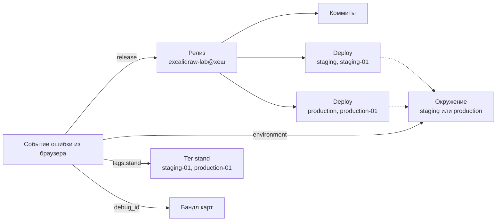
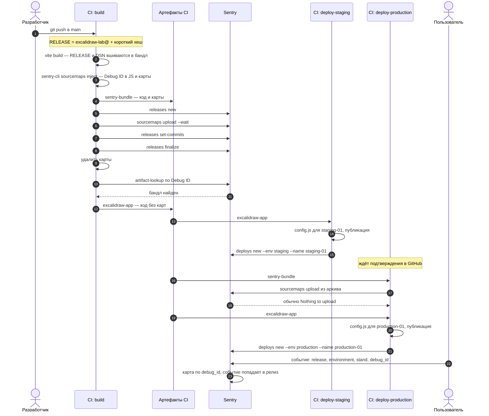
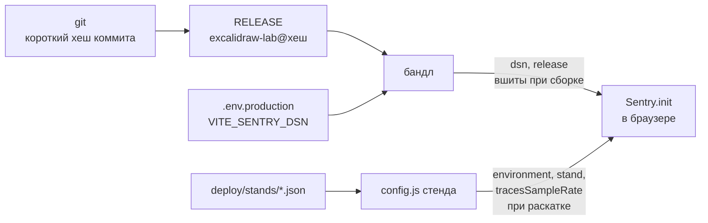
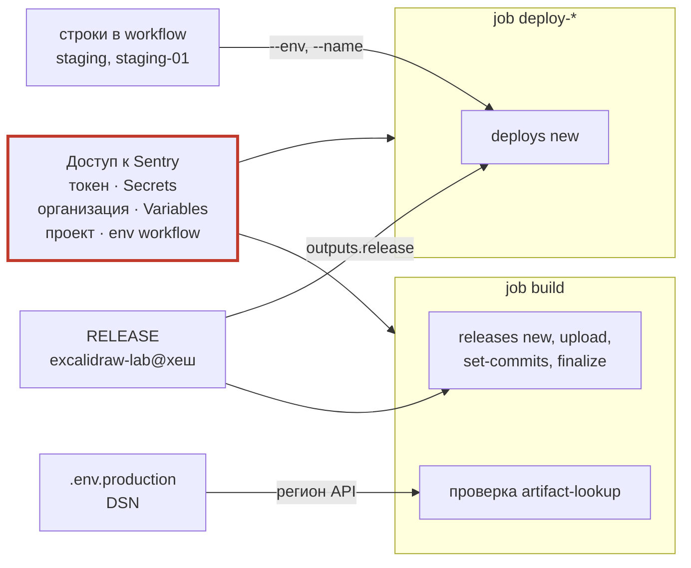

# Релиз, deploy и переменные: схемы

Шпаргалка к лабе 07. Схемы описывают файлы `.github/workflows/build-and-deploy.yml`
и `restore-sourcemaps.yml` из эталона лабы.

Mermaid отображается на GitHub. В VS Code для этого нужно расширение
«Markdown Preview Mermaid Support».

## Что с чем связывает Sentry

- **Релиз** — версия кода. Один на артефакт, создаётся при сборке.
- **Deploy** — факт выкатки релиза в окружение. Их столько, сколько раскаток.
- **Карты к событию подбираются по `debug_id`, а не по релизу** (лаба 03).

## Релиз и deploy по шагам

Восстановление карт — отдельный ручной workflow `restore-sourcemaps`: берёт
`sentry-bundle` из указанного прогона и повторяет шаг заливки.

## Откуда берутся переменные

### Что попадает в браузер

Ветка через бандл одинакова на всех стендах и вшивается **при сборке**. Ветка
через `config.js` у каждого стенда своя и пишется **при раскатке**.

### Чем CI обращается к Sentry

> **Имя окружения живёт в двух местах.** Для SDK оно берётся из
> `deploy/stands/staging-01.json`, а для `deploys new` записано в workflow
> строкой. Если переименовать окружение только в одном месте, deploy в Sentry
> окажется в одном окружении, а события — в другом. На рабочем проекте лучше
> брать оба значения из одной конфигурации стенда, например
> `jq -r .environment` по тому же файлу, из которого пишется `config.js`.

| Переменная | Откуда | Где используется | Секрет |
|---|---|---|---|
| `SENTRY_AUTH_TOKEN` | GitHub → Settings → Secrets | все вызовы `sentry-cli` и API Sentry | **да** |
| `SENTRY_ORG` | GitHub → Settings → Variables | `sentry-cli`, API | нет |
| `SENTRY_PROJECT` | `env` в workflow: `excalidraw-lab` | `sentry-cli`, API | нет |
| `RELEASE` / `VITE_APP_RELEASE` | шаг «Имя релиза»: `excalidraw-lab@` + короткий хеш | вшивается в бандл; `releases`; в deploy через `outputs.release` | нет |
| `VITE_SENTRY_DSN` | `.env.production` в репозитории | вшивается в бандл; из него вычисляется регион API | нет |
| `environment`, `stand`, `tracesSampleRate` | `deploy/stands/*.json` → `config.js` | `Sentry.init` в браузере; `--env` и `--name` у `deploys new` | нет |
| `GITHUB_TOKEN` | выдаётся GitHub на каждый прогон | публикация на Pages, скачивание архива | да, но заводить не нужно |

Единственный секрет, который заводишь ты, — токен Sentry. Всё остальное
открыто: DSN уезжает в бандл, конфигурация стенда — в публичный `config.js`.
